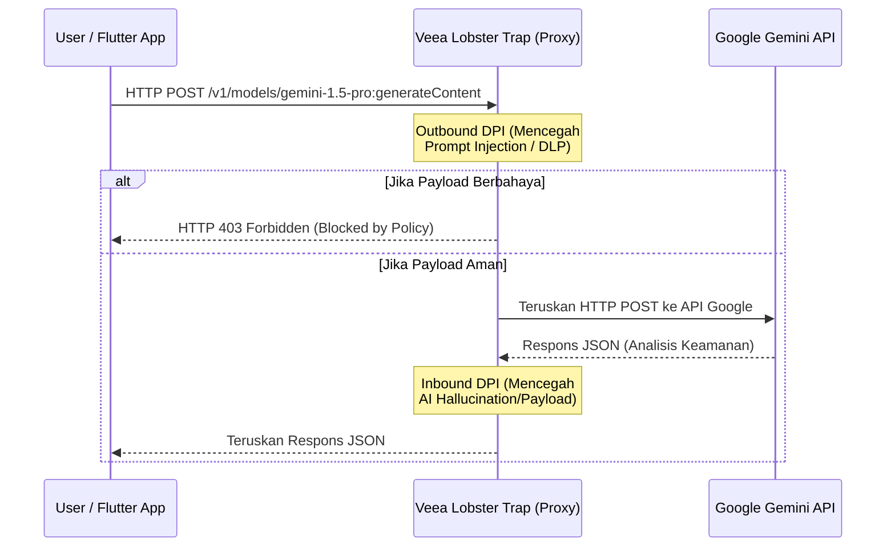

# Tahap 1: Planning & Requirements (ANOA System)

Sesuai dengan jadwal (Hari 1-4), pada tahap ini kita akan mendefinisikan secara detail *requirements* dari ANOA System sebelum masuk ke arsitektur dan kode. 

ANOA System dirancang sebagai asisten keamanan *Purple Team* (menggabungkan perspektif pertahanan/Blue dan penyerangan/Red).

> [!IMPORTANT]
> **User Review Required**
> Silakan tinjau spesifikasi di bawah ini. Jika ada fitur yang kurang atau *workflow* yang ingin diubah, beri tahu saya. Jika Anda setuju, kita bisa mengunci *requirements* ini dan lanjut ke perancangan arsitektur data (Tahap 2).

## 1. Fitur Utama Sistem ANOA

Kita perlu menentukan fitur minimal yang layak (MVP) untuk diperlombakan dalam Hackathon:

1.  **Dashboard Keamanan Terpusat (Flutter):**
    *   Antarmuka untuk memasukkan kueri/prompt keamanan.
    *   Visualisasi log inspeksi dari Lobster Trap (melihat apakah ada *prompt injection* yang diblokir).
    *   Panel status yang menunjukkan respon dari Gemini (Rekomendasi pertahanan atau simulasi serangan).
2.  **Purple Team AI Assistant (Gemini API):**
    *   **Mode Red Team:** Menganalisis kerentanan (misalnya dari log atau *snippet* kode yang diberikan pengguna) dan mensimulasikan vektor serangan.
    *   **Mode Blue Team:** Memberikan rekomendasi mitigasi, *patching*, dan deteksi berdasarkan serangan yang disimulasikan.
3.  **Trust Layer / AI Firewall (Veea Lobster Trap):**
    *   Bertindak sebagai *proxy* transparan antara aplikasi dan Gemini API.
    *   Melakukan Deep Packet Inspection (DPI) untuk mencegah kebocoran data sensitif (*Data Loss Prevention*) dan memblokir *Prompt Injection*.

## 2. Agentic Workflows

*Agentic Workflow* mengatur bagaimana agen AI beroperasi secara mandiri dalam batasan tertentu.

### Skenario Workflow Utama: "Vulnerability Assessment & Mitigation"
1.  **Input Pengguna:** Pengguna memasukkan *snippet* kode atau log jaringan ke aplikasi Flutter.
2.  **Pre-Processing:** Aplikasi membungkus input dengan *system prompt* untuk bertindak sebagai analis keamanan (*Purple Team*).
3.  **Inspeksi Keamanan (Outbound):** Lobster Trap memeriksa prompt. Jika mengandung pola *jailbreak* atau *prompt injection*, permintaan langsung digugurkan (*dropped*) dan dicatat di dashboard.
4.  **Eksekusi AI (Gemini):** Jika aman, Gemini (misal: Gemini 1.5 Flash untuk kecepatan, atau Pro untuk logika kompleks) menganalisis data, mencari kerentanan (Red Team), dan merumuskan solusi (Blue Team).
5.  **Inspeksi Output (Inbound):** Lobster Trap memeriksa respons dari Gemini untuk memastikan tidak ada *malicious payload* yang dihasilkan secara tidak sengaja oleh AI (halusinasi berbahaya).
6.  **Tampilan Hasil:** Dashboard menampilkan hasil analisis secara terstruktur kepada pengguna.

## 3. Skema Integrasi API

Untuk mewujudkan *workflow* di atas, skema komunikasi antar komponen adalah sebagai berikut:

### Konfigurasi Endpoint:
*   Aplikasi Dart/Flutter **TIDAK** memanggil `generativelanguage.googleapis.com` secara langsung.
*   Aplikasi akan memanggil `http://127.0.0.1:<PORT_LOBSTER_TRAP>` dan mengirimkan *header* API Key Gemini.
*   Lobster Trap dikonfigurasi untuk mem-*proxy* permintaan tersebut ke Google setelah inspeksi.

## Open Questions untuk Anda

> [!TIP]
> Agar kita bisa menyempurnakan *Planning & Requirements* ini:
> 1. Apakah ada kasus penggunaan (*use-case*) spesifik lain yang ingin Anda tampilkan saat presentasi Hackathon? (Misalnya: Analisis Log Server, Audit Smart Contract, atau Deteksi Phishing?)
> 2. Untuk *Lobster Trap*, apakah Anda akan menggunakan *ruleset* (kebijakan keamanan) bawaan mereka, atau kita perlu menulis *custom YAML rules* untuk ANOA?
